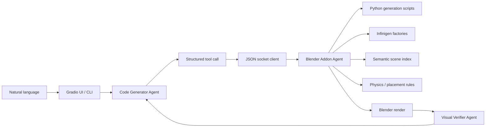

# GOSIM 2026 Paris: Script-Controlled Infinigen Asset Agent

这个项目的核心不是简单的 text-to-3D，而是一个 **可控 3D 资产生成与编辑 Agent 系统**：用户用自然语言描述目标，Agent 将需求落到受控的 Python generation script，再通过 Blender + Infinigen 生成真实 3D asset，并支持后续 editing、替换、追踪和场景级验证。

参考基础是 [Infinigen](https://github.com/princeton-vl/infinigen)：我们不让模型随意“想象”一个黑盒模型结果，而是把自然语言映射到 Infinigen 的程序化 asset factory，用 Python script 明确记录 factory、seed、scale、位置、材质和 edit prompt。这样生成过程可复现、可审计、可继续编辑。

## 核心卖点

- **Script-controlled 3D generation**：每个 asset 都由 Python script 驱动生成，底层调用 Infinigen factory，而不是一次性黑盒模型输出。
- **Reference is Infinigen**：家具、灯具、植物、水果等资产来自 Infinigen 的程序化资产系统，天然适合室内场景、仿真数据和 embodied AI 环境。
- **可控性强**：生成参数包括 factory、seed、scale、location、material color，所有关键状态都会写入 asset metadata 和 `generation_scripts/`。
- **Editing 是一等能力**：`\editing ...` 会解析已有资产，读取原 generation record，重新生成 replacement asset，并保持旧资产的位置和尺寸对齐。
- **Agent 分工清晰**：Code Generator 负责工具调用，Visual Verifier 负责看图检查，Blender Addon Agent 负责真正执行，离线 Rule Planner/CLI 负责无模型 fallback。
- **安全执行边界**：LLM 不执行任意 `bpy` 代码，只能调用白名单工具；Blender 插件在主线程里验证目标、执行变换、更新索引。
- **场景级闭环**：生成不是终点。系统会自动更新语义索引、执行物理规则、渲染预览，并可用视觉 verifier 继续修正。

## 我们解决的问题

普通 text-to-3D demo 通常只能做：

```text
prompt -> one generated mesh
```

这个项目做的是：

```text
prompt -> agent plan -> Python generation script -> Infinigen factory -> Blender asset
       -> scene index -> editing/regeneration -> render verification
```

这样带来三个关键优势：

1. **生成可复现**：同一个 factory + seed + script 可以重新得到同类资产。
2. **编辑可控**：不是在 mesh 上盲改，而是保留生成源信息后重新生成/替换。
3. **场景可管理**：每个 asset 都进入语义索引，后续可以按类别、自然语言、空间关系继续操作。

## Agent 体系



### Code Generator Agent

位置：`src/agent/agent.py`

职责：

- 读取用户自然语言指令。
- 选择白名单工具，例如 `add_infinigen_asset`、`edit_generated_asset`、`place_on`、`render_scene`。
- 遵守物理和行为规则：不主动添加 prompt 没要求的物体，不生成任意 Python/bpy 代码。
- 在 UI 中以 streaming function call 的方式推进多轮工具执行。

### Visual Verifier Agent

位置：`src/agent/visual_verifier.py`

职责：

- 读取渲染图、原始 user goal 和当前 scene info。
- 判断生成结果是否满足 prompt、空间关系和基本物理常识。
- 如果失败，输出下一步 editing instruction 给 Code Generator。
- 带 scope guard：不会因为主观美化要求添加灯光、删除无关已有物体或做 prompt 外操作。

返回格式：

```json
{
  "done": false,
  "reason": "The apple overlaps the strawberry on the tabletop.",
  "instruction": "Move the apple slightly to the right of the strawberry and keep both objects on the tabletop."
}
```

### Blender Addon Agent

位置：`blender_addon/gosim_infinigen_agent_addon.py`

职责：

- 在 Blender 内启动 socket server：`127.0.0.1:9876`。
- 接收结构化命令并在 Blender 主线程执行。
- 调用 Infinigen factory 生成资产。
- 写入 generation metadata 和 Python script。
- 维护 `gosim_scene_index.json`。
- 执行放置、材质、缩放、旋转、删除、相机、灯光、渲染等实际操作。

### Rule Planner / CLI Agent

位置：`gosim_blender_agent/planner.py`、`gosim_blender_agent/agent.py`

职责：

- 在没有 LLM 的情况下提供中英文规则解析 fallback。
- 支持 CLI demo，例如 `chat "添加一张书桌"`。
- 使用同一套 socket protocol 和 tool schema，方便快速验证 Blender 端能力。

### Camera Agent

实现位置：`blender_addon/gosim_infinigen_agent_addon.py`

职责：

- 在正式 render 前检查主体是否在镜头内、是否太小或太大。
- 渲染透明背景 mask，读取 alpha pixel bounding box。
- 根据像素中心偏移和 fill ratio 移动/拉近相机。
- 输出最终 render 和每轮调整数据。

## Script-Controlled Asset Generation

生成入口是：

```text
add_infinigen_asset
```

它会执行以下流程：

1. 解析自然语言类别，例如 `desk`、`书桌`、`apple`、`菠萝`。
2. 映射到 Infinigen factory，例如 `SimpleDeskFactory`、`FruitFactoryApple`。
3. 在 Blender 内实例化 factory，并调用 `spawn_asset` 或 `create_asset`。
4. 标记 `gosim_asset_id`、`gosim_category`、`gosim_factory` 等 metadata。
5. 应用 scale、location、material color。
6. 运行物理规则，避免悬浮和极端比例。
7. 写入可复现 Python generation script。
8. 重建 scene index。

示例映射：

```text
desk / 书桌          -> infinigen.assets.objects.shelves.SimpleDeskFactory
bed / 床             -> infinigen.assets.objects.seating.BedFactory
desk_lamp / 台灯     -> infinigen.assets.objects.lamp.DeskLampFactory
chair / 椅子         -> infinigen.assets.objects.seating.chairs.ChairFactory
microwave            -> infinigen.assets.objects.appliances.MicrowaveFactory
tv                   -> infinigen.assets.objects.appliances.TVFactory
apple / 苹果         -> infinigen.assets.objects.fruits.FruitFactoryApple
pineapple / 菠萝     -> infinigen.assets.objects.fruits.FruitFactoryPineapple
```

## 当前可生成 Asset

当前 `add_infinigen_asset` 支持以下程序化 Infinigen object assets。推荐 prompt 使用英文类别名；部分历史类别仍保留中文 alias。

### Furniture and Interior Objects

```text
bed, bed_frame, mattress, pillow,
desk, table, side_table, coffee_table,
desk_lamp, floor_lamp,
chair, bar_chair, office_chair, sofa, armchair,
cabinet, bookcase, rug, plant
```

示例 prompt：

```text
add a bed
add a pillow
add a coffee table
add a bar stool
add an armchair
add a floor lamp
```

### Appliances

```text
beverage_fridge, dishwasher, microwave, oven, tv, monitor
```

示例 prompt：

```text
add a beverage fridge
add a dishwasher
add a microwave oven
add a tv
add a computer monitor
```

### Fruits

```text
apple, blackberry, green_coconut, hairy_coconut, durian,
pineapple, starfruit, strawberry, compositional_fruit
```

示例 prompt：

```text
add an apple
add a pineapple
add a strawberry
add a green coconut
```

水果类资产有单独默认 scale 和最大尺寸限制，避免 LLM 把苹果、草莓生成成家具大小。

### Prompt Materials

`set_material` 和 `\editing ...` 支持把已有 asset 改成 Infinigen procedural material。当前支持的英文 material prompt 包括：

```text
wood, wooden, natural wood, hardwood floor, table wood,
plywood, white plywood, black plywood, wood tile, wood tiles,
ceramic, glazed ceramic, brick, concrete, glass, marble, plaster,
tile, ceramic tile, tiles, patterned tiles,
metal, metallic, aluminum, brushed metal, galvanized metal,
grained metal, polished metal, hammered metal, mirror,
black glass, black metal, white metal,
plastic, black plastic, rough plastic, translucent plastic,
clear plastic, rubber, bumpy rubber
```

示例 prompt：

```text
make the table wooden
make the chair ceramic
make the microwave brushed metal
make the monitor black plastic
\editing make the desk marble
```

## Generation Script 和 Metadata

每个由 Agent 生成的 asset 都会写入：

```text
generation_scripts/{Scene_xxx}/asset_xxx.py
```

script 记录的信息包括：

```text
asset_id
category
factory_path
seed
scale
location
material_color
source_prompt
edit_prompt
```

同时，Blender object 自身会写入 custom properties：

```text
gosim_asset_id
gosim_object_id
gosim_category
gosim_factory
gosim_seed
gosim_source_prompt
gosim_edit_prompt
gosim_generation_script
```

这就是 editing 能成立的原因：系统知道这个资产“从哪里来、怎么生成、用什么参数生成、后面被怎样改过”。

## Editing 原理

编辑入口是：

```text
edit_generated_asset
```

推荐用户写法：

```text
\editing make the desk in the scene green
\editing 把场景里的桌子改成黑色
```

执行流程：

1. 从 prompt 中解析 target，例如 `desk`。
2. 通过 scene index 找到目标 asset。
3. 读取旧 asset 的 factory、seed、source prompt、bbox 和 dimensions。
4. 使用同一个 Infinigen factory 重新 spawn 一个新 asset。
5. 应用 edit prompt 中提取的修改，例如 color/material。
6. 如果 `preserve_size=true`，按旧 bounding box 尺寸计算缩放并对齐。
7. 把新 asset 放回旧 asset 的位置。
8. 删除旧 object group。
9. 写入新的 generation script 和 edit metadata。
10. 运行物理规则并重建 scene index。

这不是简单地给 mesh 改个名字，而是 **基于原生成脚本的 replacement editing**。

## Scene Index

Blender Addon Agent 会维护：

```text
gosim_scene_index.json
```

每个 asset 的索引字段：

```text
object_id, root_name, category, factory, object_names,
location, rotation_euler, scale,
bbox_min, bbox_max, center, dimensions,
materials, relations, description, generation
```

这个索引用于：

- 自然语言引用解析：`desk`、`书桌`、`asset_xxx`、Blender object name。
- 空间关系操作：`place_on`、`place_near`、`place_against_wall`。
- editing target 定位。
- Visual Verifier 的 scene context。
- 未来接入 RAG/vector DB。

## Tool Surface

当前 Blender socket 命令：

```text
ping
get_scene_info
rebuild_scene_index
query_objects
open_blend
save_blend
add_infinigen_asset
edit_generated_asset
move_object
scale_object
rotate_object
delete_object
set_material
place_on
place_near
place_against_wall
apply_physics_rules
adjust_existing_light
adjust_camera_from_render
render_scene
```

旧版 `generate_3d_model` Python client 接口仍保留兼容，但在这个项目中会转发到 `add_infinigen_asset`，即使用 Infinigen reference 资产生成路径。

## 项目结构

```text
.
  app.py                              # Gradio UI 入口
  addon.py                            # Blender addon 入口
  blender_addon/
    gosim_infinigen_agent_addon.py    # socket server、Infinigen 生成、editing、索引、相机、渲染
  src/
    agent/
      agent.py                        # Code Generator Agent
      visual_verifier.py              # Visual Verifier Agent
    blender/client.py                 # UI 使用的 Blender socket client
    llm/                              # LLM provider adapters
  gosim_blender_agent/
    planner.py                        # 规则 planner fallback
    agent.py                          # CLI Agent
    client.py                         # CLI socket client
    infinigen_runner.py               # out-of-process Infinigen runner
  ui/                                 # Gradio/ModelScope Studio UI
  tests/                              # Visual Verifier scope guard 测试
  third_party/infinigen/              # vendored Infinigen reference
  generation_scripts/                 # generated/editable Python asset scripts
  renders/                            # render outputs
```

## Quick Start

### 1. Install

推荐 Python 3.11。脚本会优先使用 `/opt/miniconda3/envs/infinigen/bin/python`，也可以通过 `GOSIM_PYTHON` 指定 Python。

```bash
cd /Users/ll/Gosim2026-Paris
python3 -m pip install -r requirements.txt
```

可编辑安装：

```bash
python3 -m pip install -e ".[ui,llm]"
```

### 2. Configure LLMs

编辑 `config.json`，给需要的 provider 填入 `api_key`。Code Generator 和 Visual Verifier 可以使用不同模型：

```json
{
  "agents": {
    "code_generator": {"model_type": "r9s_code"},
    "visual_verifier": {"model_type": "r9s_visual_verifier"}
  },
  "llm": {
    "r9s_code": {
      "api_key": "...",
      "model": "deepseek-v4-pro",
      "api_base": "https://api.r9s.ai/v1"
    },
    "r9s_visual_verifier": {
      "api_key": "...",
      "model": "claude-opus-4-6",
      "api_base": "https://api.r9s.ai/v1"
    }
  }
}
```

### 3. Start Blender Addon Agent

```bash
cd /Users/ll/Gosim2026-Paris
bash scripts/start_blender_agent.sh
```

默认使用：

```text
third_party/infinigen/Blender.app/Contents/MacOS/Blender
```

监听地址：

```text
127.0.0.1:9876
```

### 4. Start UI

另开一个终端：

```bash
cd /Users/ll/Gosim2026-Paris
bash scripts/start_ui.sh
```

访问：

```text
http://127.0.0.1:7860
```

## Demo Prompts

```text
添加一张书桌
add a desk lamp
把台灯放到书桌上
add an apple
add a pineapple
put the pineapple on the desk
\editing make the desk in the scene green
\editing 把苹果改成绿色
把椅子放到床旁边
adjust the camera so the desk is centered
render preview
save the scene
```

## CLI

```bash
python3 -m gosim_blender_agent.cli ping
python3 -m gosim_blender_agent.cli chat "添加一张书桌"
python3 -m gosim_blender_agent.cli chat "\\editing make the desk in the scene green"
python3 -m gosim_blender_agent.cli render --path renders/preview.png
```

生成单房间 Infinigen bedroom：

```bash
python3 -m gosim_blender_agent.cli generate-bedroom \
  --output outputs/bedroom/coarse \
  --seed 0
```

## Environment Variables

```text
GOSIM_INFINIGEN_ROOT    默认 third_party/infinigen
GOSIM_BLENDER_BIN       默认 third_party/infinigen/Blender.app/Contents/MacOS/Blender
GOSIM_BLENDER_HOST      默认 127.0.0.1
GOSIM_BLENDER_PORT      默认 9876
GOSIM_RENDER_DIR        默认 renders
GOSIM_SOCKET_TIMEOUT    默认 120
GOSIM_PYTHON            指定启动 UI/Blender 依赖注入时使用的 Python
GRADIO_SERVER_PORT      默认 7860
GOSIM_UI_INBROWSER      默认 1，设为 0 可禁止自动打开浏览器
```

OpenAI-compatible planner fallback：

```text
GOSIM_LLM_BASE_URL
GOSIM_LLM_API_KEY
GOSIM_LLM_MODEL
```

## Test

```bash
python3 -m unittest tests/test_visual_verifier.py
```

当前测试覆盖 Visual Verifier scope guard，确保 verifier 不会越权删除 prompt 外已有对象。

## 一句话总结

GOSIM 不是一次性生成 mesh 的 demo，而是一个以 Infinigen 为 reference、以 Python generation script 为控制面、由多个 Agent 协作完成生成、editing、索引、渲染和验证的可控 3D asset workflow。
