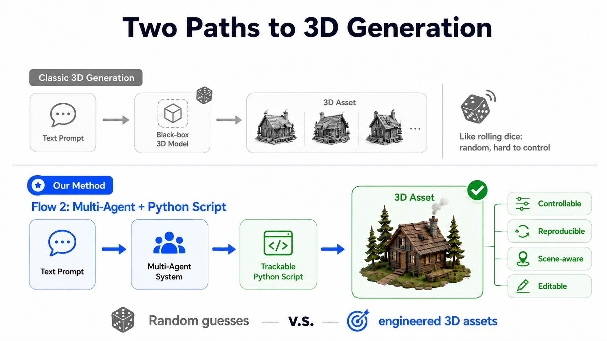
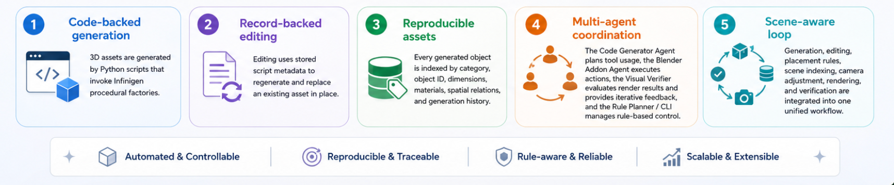

# SCRIPT3D: Script-Backed, Controllable, and Reproducible 3D Asset Generation in Blender

**SCRIPT3D** is a code-based multi-agent system for **controllable 3D asset generation and editing in Blender**.

Instead of producing a one-time black-box mesh, SCRIPT3D turns natural-language requests into **explicit Python generation scripts**, executable Blender operations, and persistent asset metadata. Every generated object can be inspected, traced, regenerated, edited, and reinserted into the scene with spatial consistency.

> **Core idea:** Treat every generated 3D asset not as a static mesh, but as a reproducible, script-backed object with metadata.


## Video Demo

<video controls src="SCRIPT3D.mp4" title="Title"></video>

---

## Table of Contents

- [Key Innovation](#key-innovation)
- [Highlights](#highlights)
- [System Architecture](#system-architecture)
- [Agent System](#agent-system)
- [Technical Depth](#technical-depth)
- [Supported Workflows](#supported-workflows)
- [Supported Object Categories](#supported-object-categories)
- [Example End-to-End Scenario](#example-end-to-end-scenario)
- [Quick Start](#quick-start)
- [Run with UI](#run-with-ui)
- [Run with CLI](#run-with-cli)
- [Project Layout](#project-layout)
- [Summary](#summary)

---

## Key Innovation

<p align="center">
  
</p>

Most text-to-3D systems follow this pattern:

```text
prompt -> generated mesh
```

This is useful for visual generation, but weak for real 3D workflows.

If a user later asks:

```text
make the desk marble
replace the apple with a green one
put the lamp on the side table
```

a black-box mesh output gives the system very little reliable information about:

- how the asset was created,
- which factory or seed produced it,
- where it is located in the scene,
- what category it belongs to,
- how to regenerate a compatible replacement,
- how to preserve its size, pose, and scene relation.

SCRIPT3D solves this by making every asset **script-backed and metadata-backed**.

```text
prompt
  -> agent plan
  -> structured tool calls
  -> Python generation script
  -> Blender asset
  -> scene index
  -> render
  -> visual verification
  -> iterative correction
```

This makes 3D generation **inspectable, repeatable, editable, and scene-aware**.

---

## Highlights

<p align="center">
  
</p>

SCRIPT3D supports:

- natural-language 3D asset generation,
- script-backed asset records,
- reproducible regeneration through factory, seed, and script metadata,
- scene-aware editing and replacement,
- automatic scene indexing,
- object placement and spatial relation handling,
- visual verification with feedback,
- automatic camera adjustment,
- both UI and CLI workflows,
- deterministic fallback control without relying fully on an LLM.

---
## System Architecture

<p align="center">
  
</p>

### Agent System

#### 1. Code Generator Agent

**Location:** `src/agent/agent.py`

The Code Generator Agent converts user instructions into safe, structured tool calls.

It is responsible for:

- understanding generation and editing prompts,
- selecting whitelisted tools,
- planning multi-step operations,
- avoiding unrequested objects,
- avoiding arbitrary unsafe Blender Python execution,
- streaming progress to the UI.

Example tool choices include:

```text
add_infinigen_asset
edit_generated_asset
place_on
render_scene
```

This keeps the system controllable while still allowing flexible natural-language interaction.

---

#### 2. Blender Addon Agent

**Location:** `blender_addon/infinigen_agent_addon.py`

The Blender Addon Agent performs all Blender-side execution.

It is responsible for:

- starting the Blender socket server,
- receiving structured commands,
- executing operations on the Blender main thread,
- invoking Infinigen procedural asset factories,
- generating Blender objects,
- applying materials, scaling, rotation, placement, and deletion,
- writing generation scripts,
- maintaining `scene_index.json`,
- rendering the scene.

This agent is the bridge between high-level agent planning and real Blender execution.

---

#### 3. Visual Verifier Agent

**Location:** `src/agent/visual_verifier.py`

The Visual Verifier Agent evaluates rendered outputs and sends targeted correction feedback.

It checks:

- whether the prompt was satisfied,
- whether requested objects are visible,
- whether spatial relations are correct,
- whether objects overlap incorrectly,
- whether the scene is physically plausible,
- whether the render is useful for evaluation.

Example verifier output:

```json
{
  "done": false,
  "reason": "The apple overlaps the strawberry on the tabletop.",
  "instruction": "Move the apple slightly to the right of the strawberry and keep both objects on the tabletop."
}
```

This enables iterative improvement instead of one-shot generation.

---

#### 4. Rule Planner / CLI Agent

**Locations:**

```text
infinigen_blender_agent/planner.py
infinigen_blender_agent/agent.py
```

The Rule Planner provides a deterministic fallback path.

It can parse a small set of English and Chinese commands without requiring an LLM. It uses the same socket protocol and tool schema as the UI agent.

This improves:

- demo stability,
- testability,
- reproducibility,
- robustness when LLM output is unavailable or unreliable.

---

#### 5. Camera Agent

**Location:** `blender_addon/infinigen_agent_addon.py`

The Camera Agent improves presentation quality by automatically adjusting scene framing.

Role:

- checks whether prompt-relevant objects are visible,
- renders a transparent mask,
- computes the alpha-pixel bounding box,
- recenters the camera,
- adjusts zoom based on object fill ratio,
- returns render metadata for debugging.

This helps ensure that generated assets are not only correct, but also clearly visible in the final demo.

---

## Technical Depth

SCRIPT3D combines several technical components into a unified pipeline:

```text
LLM planning
structured tool calling
Blender socket communication
Infinigen procedural generation
Python script generation
scene graph indexing
asset metadata persistence
replacement-based editing
render-based visual verification
automatic camera adjustment
CLI and UI control paths
```

### Script-Backed Generation

Every generated asset is backed by a Python script.

Instead of only saving a mesh, SCRIPT3D saves the process that created the mesh.

```text
generation_scripts/
  apple_001.py
  desk_002.py
  side_table_003.py
```

This makes asset generation easier to debug, replay, and modify.

---

### Scene Indexing

SCRIPT3D maintains a structured scene index:

```json
{
  "object_id": "desk_002",
  "category": "desk",
  "factory": "DeskFactory",
  "seed": 12,
  "dimensions": [1.4, 0.7, 0.75],
  "location": [0.0, 0.0, 0.75],
  "materials": ["wood"],
  "source_prompt": "add a desk",
  "script_path": "generation_scripts/desk_002.py"
}
```

The scene index gives the agent a reliable handle for later edits.

---

### Record-Backed Editing

Editing is performed using stored generation records.

```text
editing prompt
  -> target resolution
  -> retrieve asset record
  -> regenerate or modify compatible asset
  -> preserve position and scale
  -> replace old object
  -> update scene index
  -> render and verify
```

This is more reliable than directly editing arbitrary mesh geometry without knowing its origin.

---

### Visual Feedback Loop

SCRIPT3D can inspect the rendered scene and correct mistakes.

```text
render -> verifier -> correction instruction -> agent action -> render again
```

This improves completeness and demo reliability.

---

## Supported Workflows

### Generation

Generation prompts create new assets.

Example:

```text
add a marble side table
add a desk lamp on the desk
add a strawberry next to the apple
```

### Editing

Editing prompts must start with:

```text
\editing
```

Example:

```text
\editing make the desk marble
\editing make the apple green and put it on the table
\editing replace the side table with a coffee table
```

---

## Supported Object Categories

### Furniture and Interior Objects

```text
bed, bed_frame, mattress, pillow,
desk, table, side_table, coffee_table,
desk_lamp, floor_lamp,
chair, bar_chair, office_chair, sofa, armchair,
cabinet, bookcase, rug, plant
```

### Appliances

```text
beverage_fridge, dishwasher, microwave, oven, tv, monitor
```

### Fruits

```text
apple, blackberry, green_coconut, hairy_coconut, durian,
pineapple, starfruit, strawberry, compositional_fruit
```

---

## Example End-to-End Scenario

User prompt:

```text
add a desk with a lamp on it
```

SCRIPT3D performs:

```text
1. Parse prompt
2. Plan required assets
3. Generate desk through Infinigen factory
4. Generate lamp through Infinigen factory
5. Place lamp on desk
6. Save generation scripts
7. Write scene_index.json
8. Render scene
9. Verify object visibility and placement
10. Adjust camera if needed
```

Later, the user asks:

```text
\editing make the desk marble
```

SCRIPT3D then:

```text
1. Finds the existing desk in scene_index.json
2. Reads its generation record
3. Applies the requested material edit
4. Preserves desk size and position
5. Updates metadata
6. Renders the edited scene
7. Verifies the result
```

---

## Quick Start

### 1. Install

Python 3.11 is recommended.

```bash
cd /path/to/infinigen-blender-agent
python3 -m pip install -r requirements.txt
```

Editable install:

```bash
python3 -m pip install -e ".[ui,llm]"
```

---

### 2. Configure LLMs

Edit `config.json` and add API keys for the providers you want to use.

The Code Generator Agent and Visual Verifier Agent can use different models.

```json
{
  "agents": {
    "code_generator": {
      "model_type": "r9s_code"
    },
    "visual_verifier": {
      "model_type": "r9s_visual_verifier"
    }
  },
  "llm": {
    "r9s_code": {
      "api_key": "...",
      "model": "deepseek-v4-pro",
      "api_base": "https://api.r9s.ai/v1"
    },
    "r9s_visual_verifier": {
      "api_key": "...",
      "model": "claude-opus-4-6",
      "api_base": "https://api.r9s.ai/v1"
    }
  }
}
```

---

## Run with UI

### 1. Start the Blender Addon Agent

```bash
cd /path/to/infinigen-blender-agent
bash scripts/start_blender_agent.sh
```

Default Blender binary:

```text
third_party/infinigen/Blender.app/Contents/MacOS/Blender
```

Default socket:

```text
127.0.0.1:9876
```

### 2. Start the UI

In another terminal:

```bash
cd /path/to/infinigen-blender-agent
bash scripts/start_ui.sh
```

Open:

```text
http://127.0.0.1:7860
```

---

## Run with CLI

Check connection:

```bash
python3 -m infinigen_blender_agent.cli ping
```

Generate an asset:

```bash
python3 -m infinigen_blender_agent.cli chat "add a marble side table"
```

Edit an existing asset:

```bash
python3 -m infinigen_blender_agent.cli chat "\\editing make the desk marble"
```

Render the current scene:

```bash
python3 -m infinigen_blender_agent.cli render --path renders/preview.png
```

Generate a single-room Infinigen bedroom:

```bash
python3 -m infinigen_blender_agent.cli generate-bedroom \
  --output outputs/bedroom/coarse \
  --seed 0
```

---

## Project Layout

```text
SCRIPT3D/
├── blender_addon/
│   └── infinigen_agent_addon.py
│
├── src/
│   └── agent/
│       ├── agent.py
│       └── visual_verifier.py
│
├── infinigen_blender_agent/
│   ├── agent.py
│   ├── planner.py
│   └── cli.py
│
├── generation_scripts/
│   └── generated asset scripts
│
├── renders/
│   └── preview renders
│
├── scripts/
│   ├── start_blender_agent.sh
│   └── start_ui.sh
│
├── config.json
├── requirements.txt
└── README.md
```

---

## Summary

SCRIPT3D turns text-to-3D into a controllable asset workflow.

By combining procedural generation, Python scripts, persistent metadata, scene indexing, multi-agent planning, render verification, and camera correction, SCRIPT3D makes generated 3D assets:

```text
reproducible
editable
inspectable
scene-aware
demo-ready
```

This makes SCRIPT3D more than a text-to-3D generator. It is a foundation for controllable, script-backed 3D creation.