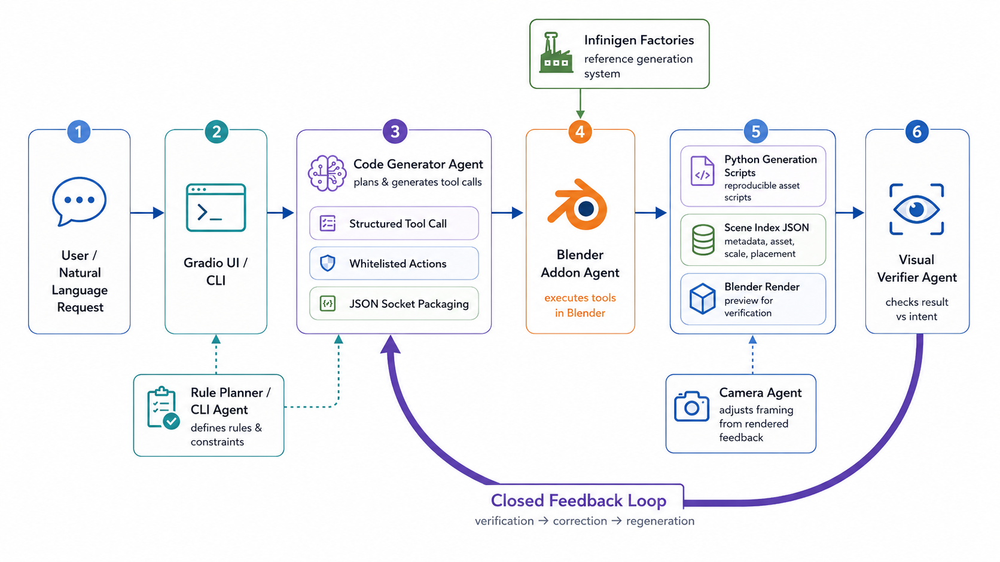

# Blender Code 3D

BlenderCode3D is a **code-based multi-agent system for controllable 3D asset generation and editing in Blender**. It turns natural-language requests into explicit Python generation scripts.

In this project, every generated asset is backed by both script and metadata. This allows the system to trace each asset back to its original generation record, including its factory, seed, script, and scene-level information.

With this record, the system can locate the target asset, regenerate a compatible replacement, apply the requested edit, and align the edited asset back into the original scene. As a result, both generation and editing become inspectable, repeatable, and scene-aware.

The system is organized around five agents:

1. Code Generator Agent: translates user prompts into structured tool calls and plans the generation or editing workflow.
2. Blender Addon Agent: executes generation, editing, scene indexing, and rendering operations inside Blender.
3. Visual Verifier Agent: evaluates rendered results and provides targeted feedback for iterative correction.
4. Rule Planner/CLI Agent: provides a deterministic fallback path through rule-based control.
5. Camera Agent: adjusts scene framing based on render feedback to keep prompt-relevant subjects visible.

## Table of Contents

- [Highlights](#highlights)
- [Motivation](#motivation)
- [Agent System](#agent-system)
- [Generation and Editing Prompt](#generation-and-editing-prompt)
- [Current Supported Object Categories](#current-supported-object-categories)
- [Quick Start](#quick-start)
- [Project Layout](#project-layout)
- [Summary](#summary)

## Highlights

- **Code-backed generation**: 3D assets are generated by Python scripts that invoke Infinigen procedural factories.
- **Record-backed editing**: editing object uses stored script metadata to regenerate and replace an existing asset in place.
- **Reproducible assets**: every generated object is indexed by category, object ID, dimensions, materials, spatial relations, and generation history.
- **Multi-agent coordination**: the Code Generator Agent plans tool usage, the Blender Addon Agent executes actions, the Visual Verifier evaluates render results and provides iterative feedback to the Code Generator Agent, and the Rule Planner/CLI manages rule-based control.
- **Scene-aware loop**: generation, editing, placement rules, scene indexing, camera adjustment, rendering, and verification are integrated into a unified workflow.

## Motivation

Most text-to-3D demos end at a single mesh:

```text
prompt -> one generated mesh
```

That is a weak interface for downstream 3D work. If the output is not tied to a reproducible generation process, it is hard to inspect, hard to regenerate, and hard to edit precisely. A user may ask for a different material, a smaller object, or a replacement style, but the system has no reliable handle on what produced the mesh in the first place.

This project treats a generated 3D asset as a script-backed object. The asset is generated by Python code through Infinigen, and the system keeps the metadata needed to locate and edit it later.

The workflow is:

```text
generation/editing prompt -> agent plan -> Python script -> Blender asset -> scene index JSON -> render verification
```

This gives the project three useful properties:

1. **Reproducible generation**: the same factory, seed, and script can recreate the same kind of asset.
2. **Controlled editing**: edits operate through stored generation records instead of blind mesh manipulation.
3. **Scene management**: generated assets are indexed by category, object id, dimensions, materials, and spatial relations.

## Agent System




### Code Generator Agent

Location: `src/agent/agent.py`

Role: converts user instructions into structured tool calls.

- Reads natural-language generation and editing prompts.
- Chooses whitelisted tools such as `add_infinigen_asset`, `edit_generated_asset`, `place_on`, and `render_scene`.
- Follows behavior constraints: do not add objects that were not requested, and do not generate arbitrary Blender Python code.
- Streams tool-call progress through the UI.

### Visual Verifier Agent

Location: `src/agent/visual_verifier.py`

Role: checks rendered results and sends targeted feedback back to the Code Generator Agent.

- Reads the rendered image, original user goal, and current scene information.
- Verifies prompt satisfaction, spatial relations, basic physics, and practical plausibility.
- Returns a structured verdict:

```json
{
  "done": false,
  "reason": "The apple overlaps the strawberry on the tabletop.",
  "instruction": "Move the apple slightly to the right of the strawberry and keep both objects on the tabletop."
}
```

### Blender Addon Agent

Location: `blender_addon/infinigen_agent_addon.py`

Role: performs the actual Blender-side work.

- Starts the Blender socket server.
- Receives structured commands and executes them on the Blender main thread.
- Calls the vendored Infinigen package and its asset factories.
- Writes generation metadata and Python scripts under `generation_scripts/`.
- Maintains `scene_index.json`.
- Performs placement, material assignment, scaling, rotation, deletion, camera adjustment, light adjustment, and rendering.

### Rule Planner / CLI Agent

Location: `infinigen_blender_agent/planner.py`, `infinigen_blender_agent/agent.py`

Role: provides a deterministic fallback and command-line demo path.

- Parses a small set of English and Chinese commands without requiring an LLM.
- Uses the same socket protocol and tool schema as the UI agent.
- Makes it easier to test Blender-side capabilities quickly.

### Camera Agent

Location: `blender_addon/infinigen_agent_addon.py`

Role: adjusts camera framing from rendered feedback.

- Checks whether prompt-relevant subjects are visible and reasonably sized before rendering.
- Renders a transparent mask and reads the alpha-pixel bounding box.
- Recenters or dollies the camera based on pixel offset and fill ratio.
- Returns final render data plus per-step adjustment metadata.

## Generation and Editing Prompt

### Generation Prompt

Generation prompts create new assets. 

Example prompts:

```text
add a marble side table
add a desk lamp on the desk
```

<!-- ## Editing Workflow

The editing tool is:

```text
edit_generated_asset
```

Execution flow:

1. Parse the target asset from the editing prompt.
2. Resolve the target through `scene_index.json`.
3. Read the old asset factory, seed, source prompt, bounding box, and dimensions.
4. Respawn a new asset from the same Infinigen factory.
5. Apply the requested edit, such as color or material.
6. If `preserve_size=true`, fit the new asset to the old bounding box.
7. Move the new asset back to the old position.
8. Delete the old object group.
9. Write a new generation script and edit metadata.
10. Run placement/physics rules and rebuild the scene index.

This is replacement-style editing from a stored generation record, not a blind mesh edit. -->

### Editing Prompt Format

Editing prompts must explicitly start with:

```text
\editing
```

Example prompts:

```text
\editing make the desk marble
\editing make the apple green and put it on the table
```

## Current Supported Object Categories

### Furniture and Interior Objects

```text
bed, bed_frame, mattress, pillow,
desk, table, side_table, coffee_table,
desk_lamp, floor_lamp,
chair, bar_chair, office_chair, sofa, armchair,
cabinet, bookcase, rug, plant
```

### Appliances

```text
beverage_fridge, dishwasher, microwave, oven, tv, monitor
```

### Fruits

```text
apple, blackberry, green_coconut, hairy_coconut, durian,
pineapple, starfruit, strawberry, compositional_fruit
```


## Quick Start

### 1. Install

Python 3.11 is recommended.

```bash
cd /path/to/infinigen-blender-agent
python3 -m pip install -r requirements.txt
```

Editable install:

```bash
python3 -m pip install -e ".[ui,llm]"
```

### 2. Configure LLMs

Edit `config.json` and add API keys for the providers you want to use. The Code Generator and Visual Verifier can use different models:

```json
{
  "agents": {
    "code_generator": {"model_type": "r9s_code"},
    "visual_verifier": {"model_type": "r9s_visual_verifier"}
  },
  "llm": {
    "r9s_code": {
      "api_key": "...",
      "model": "deepseek-v4-pro",
      "api_base": "https://api.r9s.ai/v1"
    },
    "r9s_visual_verifier": {
      "api_key": "...",
      "model": "claude-opus-4-6",
      "api_base": "https://api.r9s.ai/v1"
    }
  }
}
```

### Option1: UI

#### 1. Start the Blender Addon Agent

```bash
cd /path/to/infinigen-blender-agent
bash scripts/start_blender_agent.sh
```

Default Blender binary:

```text
third_party/infinigen/Blender.app/Contents/MacOS/Blender
```

Default socket:

```text
127.0.0.1:9876
```

#### 2. Start the UI

In another terminal:

```bash
cd /path/to/infinigen-blender-agent
bash scripts/start_ui.sh
```

Open:

```text
http://127.0.0.1:7860
```

### Option2: CLI

```bash
python3 -m infinigen_blender_agent.cli ping
python3 -m infinigen_blender_agent.cli chat "add a marble side table"
python3 -m infinigen_blender_agent.cli chat "\\editing make the desk marble"
python3 -m infinigen_blender_agent.cli render --path renders/preview.png
```

Generate a single-room Infinigen bedroom:

```bash
python3 -m infinigen_blender_agent.cli generate-bedroom \
  --output outputs/bedroom/coarse \
  --seed 0
```


## Project Layout

```text
.
  app.py                              # Gradio UI entry point
  addon.py                            # Blender addon entry point
  blender_addon/
    infinigen_agent_addon.py          # socket server, generation, editing, indexing, camera, render
  src/
    agent/
      agent.py                        # Code Generator Agent
      visual_verifier.py              # Visual Verifier Agent
    blender/client.py                 # UI Blender socket client
    llm/                              # LLM provider adapters
  infinigen_blender_agent/
    planner.py                        # Rule planner fallback
    agent.py                          # CLI agent
    client.py                         # CLI socket client
    infinigen_runner.py               # Out-of-process Infinigen runner
  ui/                                 # Gradio / ModelScope Studio UI
  tests/                              # Visual Verifier scope-guard tests
  third_party/infinigen/              # Vendored Infinigen reference
  generation_scripts/                 # Generated/editable Python asset scripts
  renders/                            # Render outputs
```

## Summary

BlenderCode3D reframes text-to-3D as a script-controlled asset workflow. Infinigen provides procedural reference assets, Python scripts make generation inspectable and repeatable, and the agent stack turns natural-language generation and editing requests into structured Blender operations that can be indexed, rendered, verified, and refined.
