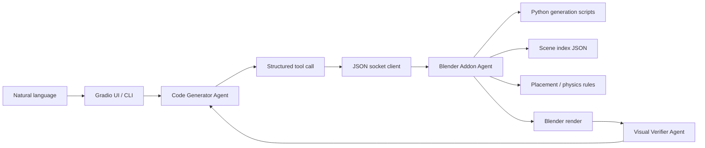

# Script-Controlled Infinigen Asset Agent

This project is a controllable 3D asset generation and editing agent for Blender. It is not a one-shot text-to-3D demo. The core workflow turns a natural-language request into a structured tool call, records the result as a Python generation script, generates the asset through Blender + [Infinigen](https://github.com/princeton-vl/infinigen), and keeps enough metadata to support later replacement-style editing.

The key design choice is that Infinigen is the reference generation system. Assets are created from Infinigen procedural factories instead of opaque mesh outputs, so the system can track factory path, seed, scale, placement, material, source prompt, and edit prompt.

## Table of Contents

- [Highlights](#highlights)
- [Why This Exists](#why-this-exists)
- [Agent System](#agent-system)
- [Script-Controlled Generation](#script-controlled-generation)
- [Generation Prompt Examples](#generation-prompt-examples)
- [Category](#category)
- [Generation Scripts and Metadata](#generation-scripts-and-metadata)
- [Editing Workflow](#editing-workflow)
- [Editing Prompt Format](#editing-prompt-format)
- [Scene Index](#scene-index)
- [Tool Surface](#tool-surface)
- [Quick Start](#quick-start)
- [CLI](#cli)
- [TODO](#todo)

## Highlights

- **Script-controlled 3D generation**: every generated asset is backed by a Python script and an Infinigen factory path.
- **Infinigen as reference**: furniture, appliances, lamps, plants, rugs, and fruits come from Infinigen procedural asset factories.
- **Controllable asset records**: factory, seed, scale, location, material, prompt, and edit history are written to metadata and `generation_scripts/`.
- **Editing as a first-class workflow**: `\editing ...` resolves an existing generated asset, respawns a replacement from the original factory record, applies the edit, and aligns it back to the old asset.
- **Multi-agent architecture**: a Code Generator Agent plans tool calls, a Blender Addon Agent executes them, a Visual Verifier Agent checks rendered results, and a Rule Planner/CLI Agent provides a no-model fallback.
- **Constrained execution**: the LLM does not run arbitrary `bpy` code. It can only call predefined tools.
- **Scene-level loop**: every operation can update the scene index, run placement/physics rules, render a preview, and feed the result back into verification.

## Why This Exists

Most text-to-3D demos follow this shape:

```text
prompt -> one generated mesh
```

That makes editing hard: the output is often opaque, hard to reproduce, and difficult to modify in a targeted way.

This project uses a script-controlled workflow:

```text
generation/editing prompt -> agent plan -> Python script -> Blender asset
                           -> scene index JSON -> render verification
```

That gives the project three useful properties:

1. **Reproducible generation**: the same factory, seed, and script can recreate a comparable asset.
2. **Controlled editing**: edits operate through stored generation records instead of blind mesh manipulation.
3. **Scene management**: generated assets are indexed by category, object id, dimensions, materials, and relations.

## Agent System



### Code Generator Agent

Location: `src/agent/agent.py`

Role: converts user instructions into structured tool calls.

- Reads natural-language generation and editing prompts.
- Chooses whitelisted tools such as `add_infinigen_asset`, `edit_generated_asset`, `place_on`, and `render_scene`.
- Follows behavior constraints: do not add objects that were not requested, and do not generate arbitrary Blender Python code.
- Streams tool-call progress through the UI.

### Visual Verifier Agent

Location: `src/agent/visual_verifier.py`

Role: checks rendered results and sends targeted feedback back to the Code Generator Agent.

- Reads the rendered image, original user goal, and current scene information.
- Verifies prompt satisfaction, spatial relations, basic physics, and practical plausibility.
- Returns a structured verdict:

```json
{
  "done": false,
  "reason": "The apple overlaps the strawberry on the tabletop.",
  "instruction": "Move the apple slightly to the right of the strawberry and keep both objects on the tabletop."
}
```

### Blender Addon Agent

Location: `blender_addon/infinigen_agent_addon.py`

Role: performs the actual Blender-side work.

- Starts the Blender socket server.
- Receives structured commands and executes them on the Blender main thread.
- Calls the vendored Infinigen package and its asset factories.
- Writes generation metadata and Python scripts under `generation_scripts/`.
- Maintains `scene_index.json`.
- Performs placement, material assignment, scaling, rotation, deletion, camera adjustment, light adjustment, and rendering.

### Rule Planner / CLI Agent

Location: `infinigen_blender_agent/planner.py`, `infinigen_blender_agent/agent.py`

Role: provides a deterministic fallback and command-line demo path.

- Parses a small set of English and Chinese commands without requiring an LLM.
- Uses the same socket protocol and tool schema as the UI agent.
- Makes it easier to test Blender-side capabilities quickly.

### Camera Agent

Location: `blender_addon/infinigen_agent_addon.py`

Role: adjusts camera framing from rendered feedback.

- Checks whether prompt-relevant subjects are visible and reasonably sized before rendering.
- Renders a transparent mask and reads the alpha-pixel bounding box.
- Recenters or dollies the camera based on pixel offset and fill ratio.
- Returns final render data plus per-step adjustment metadata.

## Script-Controlled Generation

The main generation tool is:

```text
add_infinigen_asset
```

Execution flow:

1. Parse the requested category, such as `desk`, `pillow`, `microwave`, or `apple`.
2. Resolve it to an Infinigen factory, such as `SimpleDeskFactory` or `FruitFactoryApple`.
3. Instantiate the factory in Blender and call `spawn_asset` or `create_asset`.
4. Tag Blender objects with `agent_asset_id`, `agent_category`, and `agent_factory`.
5. Apply scale, location, and material settings.
6. Run placement/physics rules to reduce floating objects and extreme proportions.
7. Write a reproducible Python generation script.
8. Rebuild the scene index.

### Generation Prompt Examples

Generation prompts create new assets. Recommended forms:

```text
add a <category>
add a <category> on/near <target>
add a <category> with <material or color>
```

Use category names from the [Category](#category) section when possible. If the prompt needs placement, state the support/reference object directly. Fruits do not need explicit scale; the executor applies small tabletop-object defaults.

Example prompts:

```text
add a marble side table
add a desk lamp on the desk
```

## Category

`add_infinigen_asset` supports the following Infinigen-backed asset categories.

### Furniture and Interior Objects

```text
bed, bed_frame, mattress, pillow,
desk, table, side_table, coffee_table,
desk_lamp, floor_lamp,
chair, bar_chair, office_chair, sofa, armchair,
cabinet, bookcase, rug, plant
```

### Appliances

```text
beverage_fridge, dishwasher, microwave, oven, tv, monitor
```

### Fruits

```text
apple, blackberry, green_coconut, hairy_coconut, durian,
pineapple, starfruit, strawberry, compositional_fruit
```

Fruit categories use separate default scales and maximum dimensions to avoid furniture-sized apples or strawberries.

### Category Reference

| Category | Common aliases | Infinigen reference factory |
| --- | --- | --- |
| `bed` | `床`, `卧床`, `双人床` | `infinigen.assets.objects.seating.BedFactory` |
| `bed_frame` | `bed frame`, `bedframe` | `infinigen.assets.objects.seating.BedFrameFactory` |
| `mattress` | `mattress` | `infinigen.assets.objects.seating.MattressFactory` |
| `pillow` | `pillow`, `cushion` | `infinigen.assets.objects.seating.PillowFactory` |
| `desk` | `书桌`, `桌子`, `工作桌`, `办公桌` | `infinigen.assets.objects.shelves.SimpleDeskFactory` |
| `table` | `餐桌`, `大桌子` | `infinigen.assets.objects.tables.TableDiningFactory` |
| `side_table` | `side table`, `nightstand`, `床头柜` | `infinigen.assets.objects.tables.SideTableFactory` |
| `coffee_table` | `coffee table`, `茶几` | `infinigen.assets.objects.tables.CoffeeTableFactory` |
| `desk_lamp` | `desk lamp`, `lamp`, `台灯` | `infinigen.assets.objects.lamp.DeskLampFactory` |
| `floor_lamp` | `floor lamp`, `落地灯` | `infinigen.assets.objects.lamp.FloorLampFactory` |
| `chair` | `椅子`, `座椅` | `infinigen.assets.objects.seating.chairs.ChairFactory` |
| `bar_chair` | `bar chair`, `bar stool`, `stool` | `infinigen.assets.objects.seating.chairs.BarChairFactory` |
| `office_chair` | `office chair`, `办公椅` | `infinigen.assets.objects.seating.chairs.OfficeChairFactory` |
| `sofa` | `沙发` | `infinigen.assets.objects.seating.SofaFactory` |
| `armchair` | `arm chair`, `lounge chair` | `infinigen.assets.objects.seating.ArmChairFactory` |
| `beverage_fridge` | `beverage fridge`, `mini fridge`, `fridge` | `infinigen.assets.objects.appliances.BeverageFridgeFactory` |
| `dishwasher` | `dishwasher` | `infinigen.assets.objects.appliances.DishwasherFactory` |
| `microwave` | `microwave oven` | `infinigen.assets.objects.appliances.MicrowaveFactory` |
| `oven` | `oven` | `infinigen.assets.objects.appliances.OvenFactory` |
| `tv` | `television` | `infinigen.assets.objects.appliances.TVFactory` |
| `monitor` | `computer monitor`, `display` | `infinigen.assets.objects.appliances.MonitorFactory` |
| `cabinet` | `柜子`, `储物柜` | `infinigen.assets.objects.shelves.SingleCabinetFactory` |
| `bookcase` | `bookshelf`, `书架` | `infinigen.assets.objects.shelves.SimpleBookcaseFactory` |
| `rug` | `地毯` | `infinigen.assets.objects.elements.RugFactory` |
| `plant` | `盆栽`, `植物` | `infinigen.assets.objects.tableware.PlantContainerFactory` |
| `apple` | `苹果`, `青苹果`, `绿苹果` | `infinigen.assets.objects.fruits.FruitFactoryApple` |
| `blackberry` | `黑莓` | `infinigen.assets.objects.fruits.FruitFactoryBlackberry` |
| `green_coconut` | `green coconut`, `青椰子`, `椰青` | `infinigen.assets.objects.fruits.FruitFactoryCoconutgreen` |
| `hairy_coconut` | `hairy coconut`, `coconut`, `椰子` | `infinigen.assets.objects.fruits.FruitFactoryCoconuthairy` |
| `durian` | `榴莲` | `infinigen.assets.objects.fruits.FruitFactoryDurian` |
| `pineapple` | `菠萝`, `凤梨` | `infinigen.assets.objects.fruits.FruitFactoryPineapple` |
| `starfruit` | `star fruit`, `杨桃` | `infinigen.assets.objects.fruits.FruitFactoryStarfruit` |
| `strawberry` | `草莓` | `infinigen.assets.objects.fruits.FruitFactoryStrawberry` |
| `compositional_fruit` | `mixed fruit`, `组合水果` | `infinigen.assets.objects.fruits.FruitFactoryCompositional` |

### Prompt Materials

`set_material` and `\editing ...` can apply Infinigen procedural material prompts to existing generated assets.

```text
wood, wooden, natural wood, hardwood floor, table wood,
plywood, white plywood, black plywood, wood tile, wood tiles,
ceramic, glazed ceramic, brick, concrete, glass, marble, plaster,
tile, ceramic tile, tiles, patterned tiles,
metal, metallic, aluminum, brushed metal, galvanized metal,
grained metal, polished metal, hammered metal, mirror,
black glass, black metal, white metal,
plastic, black plastic, rough plastic, translucent plastic,
clear plastic, rubber, bumpy rubber
```

## Generation Scripts and Metadata

Every generated asset writes a script under:

```text
generation_scripts/{Scene_xxx}/asset_xxx.py
```

The script records:

```text
asset_id
category
factory_path
seed
scale
location
material_color
source_prompt
edit_prompt
```

Blender objects also receive custom properties:

```text
agent_asset_id
agent_object_id
agent_category
agent_factory
agent_seed
agent_source_prompt
agent_edit_prompt
agent_generation_script
```

This is what makes editing possible: the system knows where an asset came from, which factory produced it, which seed was used, and which edits have been applied.

## Editing Workflow

The editing tool is:

```text
edit_generated_asset
```

Execution flow:

1. Parse the target asset from the editing prompt.
2. Resolve the target through `scene_index.json`.
3. Read the old asset factory, seed, source prompt, bounding box, and dimensions.
4. Respawn a new asset from the same Infinigen factory.
5. Apply the requested edit, such as color or material.
6. If `preserve_size=true`, fit the new asset to the old bounding box.
7. Move the new asset back to the old position.
8. Delete the old object group.
9. Write a new generation script and edit metadata.
10. Run placement/physics rules and rebuild the scene index.

This is replacement-style editing from a stored generation record, not a blind mesh edit.

### Editing Prompt Format

Editing prompts must explicitly start with:

```text
\editing
```

Standard form:

```text
\editing <edit instruction mentioning the target asset>
```

Recommended templates:

```text
\editing make the <target category/object> <material or color>
\editing change the <target category/object> to <material or color>
\editing make the <target category/object> larger/smaller
\editing replace/regenerate the <target category/object> as <new style>
```

Rules:

- Keep the `\editing` prefix.
- Mention a target, such as `desk`, `apple`, `asset_xxx`, or a Blender object name.
- Prefer assets generated by this system because they have generation metadata and scripts.
- Do not use `add ...` for editing. Editing is a replacement workflow, not a creation workflow.
- Prefer material names from [Prompt Materials](#prompt-materials).

Example prompts:

```text
\editing make the desk marble
\editing make asset_2f1e36e18681 black metal
```

## Scene Index

The Blender Addon Agent maintains:

```text
scene_index.json
```

Each indexed asset includes:

```text
object_id, root_name, category, factory, object_names,
location, rotation_euler, scale,
bbox_min, bbox_max, center, dimensions,
materials, relations, description, generation
```

The scene index supports:

- Natural-language reference resolution: `desk`, `asset_xxx`, Blender object names, and supported aliases.
- Spatial operations: `place_on`, `place_near`, and `place_against_wall`.
- Editing target lookup.
- Visual Verifier scene context.
- Future RAG/vector search integration.

## Tool Surface

Blender socket commands:

```text
ping
get_scene_info
rebuild_scene_index
query_objects
open_blend
save_blend
add_infinigen_asset
edit_generated_asset
move_object
scale_object
rotate_object
delete_object
set_material
place_on
place_near
place_against_wall
apply_physics_rules
adjust_existing_light
adjust_camera_from_render
render_scene
```

The legacy-compatible Python client method `generate_3d_model` is retained, but in this project it forwards to `add_infinigen_asset`.

## Project Layout

```text
.
  app.py                              # Gradio UI entry point
  addon.py                            # Blender addon entry point
  blender_addon/
    infinigen_agent_addon.py          # socket server, generation, editing, indexing, camera, render
  src/
    agent/
      agent.py                        # Code Generator Agent
      visual_verifier.py              # Visual Verifier Agent
    blender/client.py                 # UI Blender socket client
    llm/                              # LLM provider adapters
  infinigen_blender_agent/
    planner.py                        # Rule planner fallback
    agent.py                          # CLI agent
    client.py                         # CLI socket client
    infinigen_runner.py               # Out-of-process Infinigen runner
  ui/                                 # Gradio / ModelScope Studio UI
  tests/                              # Visual Verifier scope-guard tests
  third_party/infinigen/              # Vendored Infinigen reference
  generation_scripts/                 # Generated/editable Python asset scripts
  renders/                            # Render outputs
```

## Quick Start

### 1. Install

Python 3.11 is recommended.

```bash
cd /path/to/infinigen-blender-agent
python3 -m pip install -r requirements.txt
```

Editable install:

```bash
python3 -m pip install -e ".[ui,llm]"
```

### 2. Configure LLMs

Edit `config.json` and add API keys for the providers you want to use. The Code Generator and Visual Verifier can use different models:

```json
{
  "agents": {
    "code_generator": {"model_type": "r9s_code"},
    "visual_verifier": {"model_type": "r9s_visual_verifier"}
  },
  "llm": {
    "r9s_code": {
      "api_key": "...",
      "model": "deepseek-v4-pro",
      "api_base": "https://api.r9s.ai/v1"
    },
    "r9s_visual_verifier": {
      "api_key": "...",
      "model": "claude-opus-4-6",
      "api_base": "https://api.r9s.ai/v1"
    }
  }
}
```

### 3. Start the Blender Addon Agent

```bash
cd /path/to/infinigen-blender-agent
bash scripts/start_blender_agent.sh
```

Default Blender binary:

```text
third_party/infinigen/Blender.app/Contents/MacOS/Blender
```

Default socket:

```text
127.0.0.1:9876
```

### 4. Start the UI

In another terminal:

```bash
cd /path/to/infinigen-blender-agent
bash scripts/start_ui.sh
```

Open:

```text
http://127.0.0.1:7860
```

## CLI

```bash
python3 -m infinigen_blender_agent.cli ping
python3 -m infinigen_blender_agent.cli chat "add a marble side table"
python3 -m infinigen_blender_agent.cli chat "\\editing make the desk marble"
python3 -m infinigen_blender_agent.cli render --path renders/preview.png
```

Generate a single-room Infinigen bedroom:

```bash
python3 -m infinigen_blender_agent.cli generate-bedroom \
  --output outputs/bedroom/coarse \
  --seed 0
```

## Environment Variables

```text
INFINIGEN_AGENT_INFINIGEN_ROOT    default: third_party/infinigen
INFINIGEN_AGENT_BLENDER_BIN       default: third_party/infinigen/Blender.app/Contents/MacOS/Blender
INFINIGEN_AGENT_BLENDER_HOST      default: 127.0.0.1
INFINIGEN_AGENT_BLENDER_PORT      default: 9876
INFINIGEN_AGENT_RENDER_DIR        default: renders
INFINIGEN_AGENT_SOCKET_TIMEOUT    default: 120
INFINIGEN_AGENT_PYTHON            optional Python executable override
GRADIO_SERVER_PORT                default: 7860
INFINIGEN_AGENT_UI_INBROWSER      default: 1; set to 0 to avoid opening a browser automatically
```

OpenAI-compatible planner fallback:

```text
INFINIGEN_AGENT_LLM_BASE_URL
INFINIGEN_AGENT_LLM_API_KEY
INFINIGEN_AGENT_LLM_MODEL
```

## Test

```bash
python3 -m unittest tests/test_visual_verifier.py
```

## TODO

- **Expand asset coverage**: add more Infinigen factories and keep the category registry synchronized with the Blender addon.
- **Broaden editing operations**: support more procedural edits beyond material/color replacement, including shape parameters where Infinigen factories expose them.
- **Persist edit history**: store generation and editing records in a durable SQLite/JSONL scene database instead of relying only on object custom properties and script files.
- **Improve collision handling**: replace current bounding-box heuristics with stronger support-surface and interpenetration checks.
- **Vector search over scene assets**: embed `description`, `relations`, and edit history for better natural-language target lookup.
- **Regression tests for Blender tools**: add integration tests for `add_infinigen_asset`, `edit_generated_asset`, `place_on`, and `render_scene` in a headless Blender environment.
- **UI polish**: expose generation scripts, asset metadata, and verifier decisions directly in the right-side panel.
- **Packaging**: document or automate the vendored Blender/Infinigen setup for non-macOS environments.

## Summary

This project treats 3D generation as a controllable script-backed workflow. Infinigen provides the procedural reference assets; the agents plan, execute, verify, and edit those assets through structured Blender tools.
