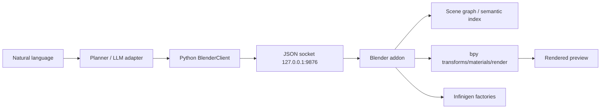

# Architecture

This project integrates two roles:

- Infinigen provides procedural indoor scenes and furniture factories.
- The Blender agent layer provides natural-language interaction, a socket bridge,
  scene indexing, editing tools, and visual preview.

## Key Boundaries

The LLM or rule planner never receives raw `bpy` code execution rights. It emits
structured tool calls only. The Blender addon validates object references, resolves
semantic aliases through the scene index, performs geometry edits, and then writes
an updated `gosim_scene_index.json`.

## Scene Index

The index is generated inside Blender and saved next to the `.blend` file by
default. Each indexed asset contains:

- `object_id`
- `root_name`
- `category`
- `factory`
- `object_names`
- `location`
- `rotation_euler`
- `scale`
- `bbox_min`
- `bbox_max`
- `center`
- `dimensions`
- `materials`
- `relations`
- `description`

This supports both structured lookup and RAG-style semantic retrieval. The current
implementation stores JSON. A vector database can be added later by embedding each
asset's `description` plus relation text.

## Editing Tools

Implemented Blender commands:

- `get_scene_info`
- `rebuild_scene_index`
- `query_objects`
- `open_blend`
- `save_blend`
- `add_infinigen_asset`
- `move_object`
- `scale_object`
- `rotate_object`
- `delete_object`
- `set_material`
- `place_on`
- `place_near`
- `place_against_wall`
- `render_scene`

## Infinigen Generation

There are two generation paths:

1. Out-of-process scene generation through `gosim_blender_agent.infinigen_runner`.
   This calls `python -m infinigen.launch_blender` inside the vendored
   `third_party/infinigen` copy.

2. In-Blender asset insertion through `add_infinigen_asset`.
   This imports Infinigen factory classes such as `BedFactory`,
   `SimpleDeskFactory`, and `DeskLampFactory`, spawns the asset, tags it with
   GOSIM metadata, places it in the current scene, and refreshes the index.

## Recommended Next Extensions

- Tighten the LLM prompt around the current Infinigen function schema.
- Add a persistent SQLite scene store.
- Add vector embeddings for asset descriptions and edit history.
- Add stronger collision checks before accepting placement.
- Add room/wall extraction tailored to Infinigen's indoor solver outputs.
